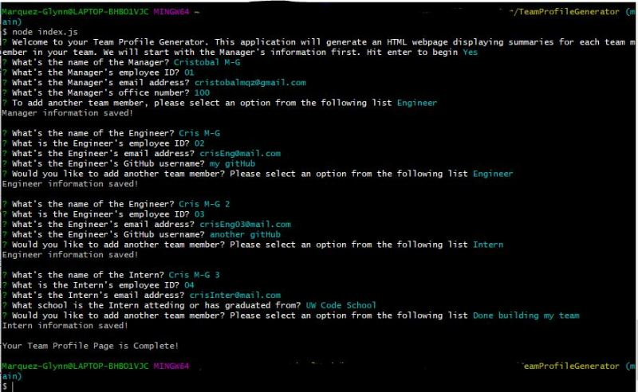
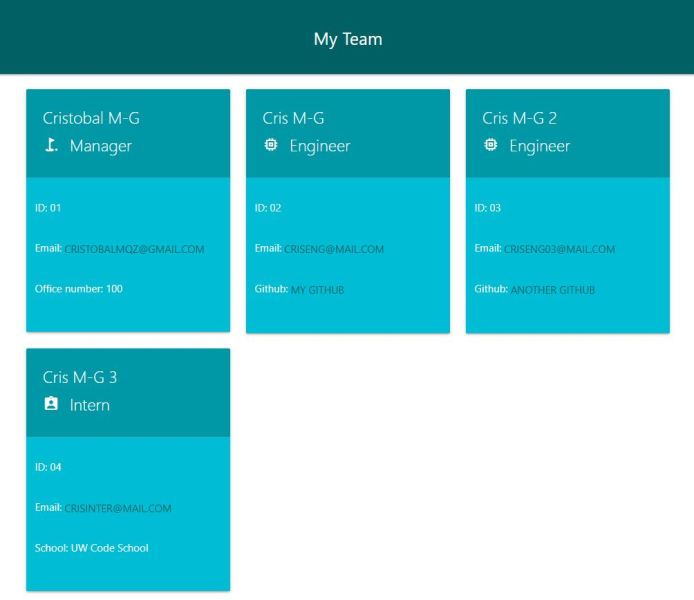

# Team Profile Generator
  

  ## Description
  
  - This is my second homework assignment using NODE.js for the Full Stack Web Developer course I'm enrolled in. The assigment was to create a command-line application that dynamically generates a Team Profile HTML page from input provided by the user.
  - The application lets the user add information for a Manager, Engineer, and Intern team member.
  - By completing this assignment, I was able to implement lessons from my course, including: Set Jest.js tests, Code JavaScript for a Node.js application, Establish Classes , Implement several JS modules, work with a CSS framework, Use FS.js to create and append files, and finally apply Inquirer.js for the user interface on the command-line.
  - See the Usage Information of this README for a link to a walkthrough video that demonstrates the appication's functionality.
  

  The following are screenshots of the final version of the application in the terminal and a sample HTML page generated by the command-line application. 

    
    
   
  ## Table of Contents
   
  - [Installation](#installation)
  - [Usage](#usage)
  - [Credits](#credits)
  - [License](#license)
  - [How To Contribute](#how_to_contribute)
  - [Tests](#tests)
  - [Questions](#questions)
  
  ## Installation
  
  To use this application, there are a few steps to folllow:
  1) Have [NODE.js](https://nodejs.org/en/download/) installed on your computer. 
  2) Download Inquirer from your command-line "npm install inquirer" 
  4) Download Jest from your command-line "npm install jest" if you want to run the unit tests created for the different Class files.
  4) Clone my [GitHub](https://github.com/CM-GDev/TeamProfileGenerator) repo for this application.
  
  ## Usage
  
  After installing the items above, use this [Walkthrough](https://youtu.be/GO807vkxKDg) video as a guide for using this application.
    
  ## Credits

  For this homework assignment, I relied on the documentation for [Inquirer](https://www.npmjs.com/package/inquirer), [Jest](https://www.npmjs.com/package/jest) and [Materialize](https://materializecss.com/) CSS framework.

  ## License
  
  MIT License

  Copyright (c) [2022] [Cristobal Marquez-Glynn]
  
  ## How to Contribute
  
  - [Contributor Covenant](https://www.contributor-covenant.org/) 
  - I'm open to suggestions on how to improve this product.
  
  ## Tests
  
  In my [GitHub](https://github.com/CM-GDev/TeamProfileGenerator) repository, I included Jest tests created to verify the four Classes functionality.
  
  ## Questions
   
  For any questions, you can reach me through my [GITHUB](https://github.com/CM-GDev) or email: cristobalmqz@gmail.com account. 
